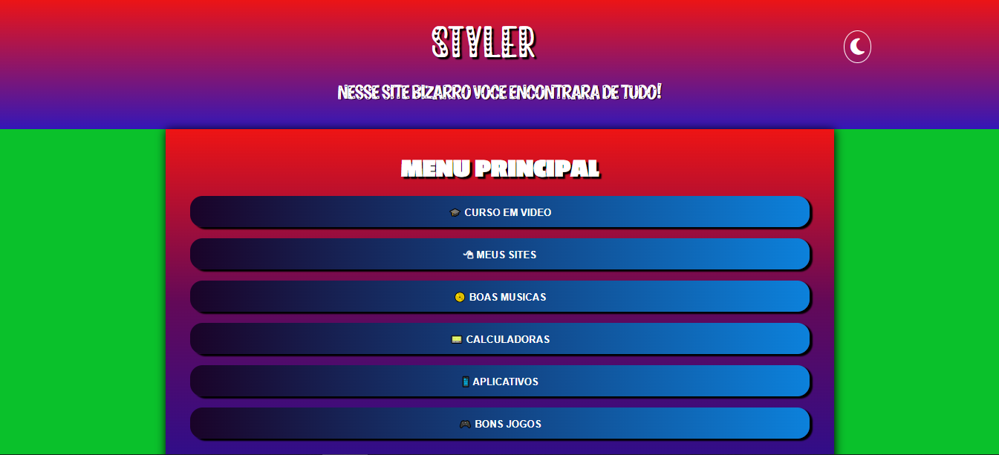

# STYLER
👨‍⚖️STYLER É UM SITE QUE RODA NO GITHUB PAGES.

  

## DESCRIÇÃO:
Este site foi meticulosamente criado por um desenvolvedor independente, refletindo suas preferências pessoais, inclusive em relação ao uso expressivo de cores. Como resultado, você pode encontrar um design vibrante e expressivo, proporcionando uma experiência única aos visitantes.

### CONTEÚDO VARIADO:
O site é um verdadeiro tesouro digital, oferecendo uma ampla gama de recursos e entretenimento. Desde músicas até jogos, aplicações, calculadoras e muito mais, você encontrará uma variedade de conteúdos para explorar e desfrutar.

### LIBERDADE DE MODIFICAÇÃO:
Queremos que você saiba que temos total liberdade para adicionar, alterar ou remover qualquer página ou função do site sem aviso prévio. Isso nos permite manter o site dinâmico e adaptado às necessidades e interesses em constante evolução.

### ACESSIBILIDADE E RESPONSIVIDADE:
Embora o site seja totalmente funcional em dispositivos móveis, oferecendo uma experiência responsiva, recomendamos explorá-lo em seu computador para uma experiência mais completa. Isso garante que você aproveite ao máximo todos os recursos e o layout projetado para telas maiores.

### IMPORTÂNCIA DO JAVASCRIPT:
Observe que o conteúdo contido nos "MENU PRINCIPAL" e "SUBMENUS" será exibido apenas quando o JavaScript estiver habilitado. Desabilitar o JavaScript através de extensões pode resultar na exibição de uma página em branco. Recomendamos manter o JavaScript habilitado para desfrutar de todas as funcionalidades interativas e dinâmicas do site.

### LIMITAÇÃO DA HOSPEDAGEM NO GITHUB PAGES:
Este site é hospedado no GitHub Pages, o que proporciona uma maneira conveniente e gratuita de compartilhar conteúdo online. No entanto, é importante notar que o GitHub Pages tem algumas limitações em relação a recursos avançados de servidor. Isso pode afetar a implementação de determinadas funcionalidades mais complexas que podem ser encontradas em plataformas de hospedagem mais robustas.

Agradecemos por explorar nosso site e esperamos que você aproveite a experiência diversificada que preparamos para você!

## MAIS:
- [CLIQUE AQUI PARA ENTRAR NO SITE](https://vilhalva.github.io/STYLER/index.html)
- [VEJA OS VIDEOS SOBRE ESSE SITE](https://www.youtube.com/@vilhalva100/search?query=STYLER)
- [ESSE SITE FOI CRIADO PELO VILHALVA](https://github.com/VILHALVA)
- [VEJA O HISTÓRICO DE ATUALIZAÇÕES](./UPDATES.md)
